<!-- ╔══════════════════════════════════════════════════════════════════════╗
     ║  St0lym / St0lym  ·  GitHub profile                                   ║
     ║  Visual system lives in /assets — this file is composition + text.   ║
     ║  Hero is an SVG placeholder today; swap to .webp art (see assets/).   ║
     ╚══════════════════════════════════════════════════════════════════════╝ -->

<!-- ░░░░░░░░░░░░░░░░░░░░  HERO  ░░░░░░░░░░░░░░░░░░░░ -->

<a href="https://st0lym.stakon.fr">
  <picture>
    <source media="(prefers-color-scheme: dark)" srcset="./assets/hero/hero-dark.svg">
    <source media="(prefers-color-scheme: light)" srcset="./assets/hero/hero-light.svg">
    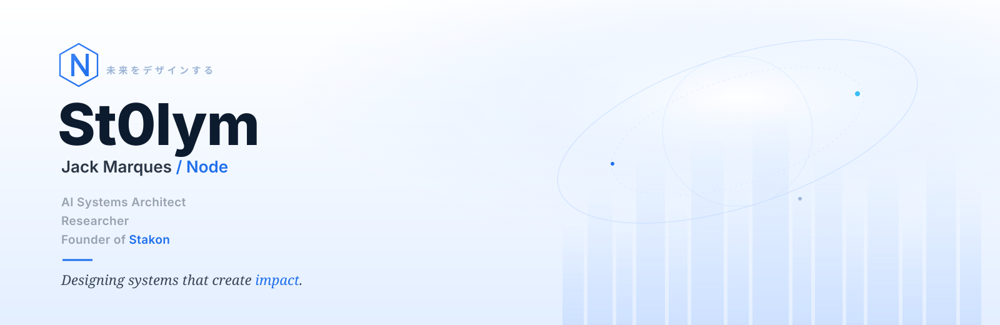
  </picture>
</a>

<!-- ░░░░░░░░░░░░░░░░░░░░  IDENTITY / ABOUT  ░░░░░░░░░░░░░░░░░░░░ -->
## About

<table border="0">
<tr>
<td width="72%" valign="top">

I build **AI systems**, **autonomous infrastructure** and experimental tools
designed to transform complex ideas into operational products.

My work sits at the intersection of **artificial intelligence**, **distributed
systems**, **research**, **product architecture** and **automation** — from the
first question to the shipped system.

</td>
<td width="28%" valign="top" align="center">

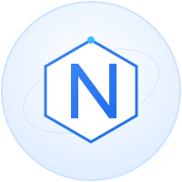 
<b>Geneva, Switzerland</b> 
<a href="https://st0lym.stakon.fr">st0lym.stakon.fr</a> · open to consulting

</td>
</tr>
</table>

<!-- ░░░░░░░░░░░░░░░░░░░░  FEATURED SYSTEMS  ░░░░░░░░░░░░░░░░░░░░ -->
## Featured Systems

<table border="0">
<tr>
<td width="50%"><a href="https://st0lym.stakon.fr">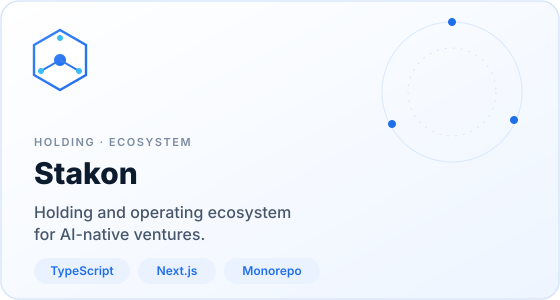</a></td>
<td width="50%">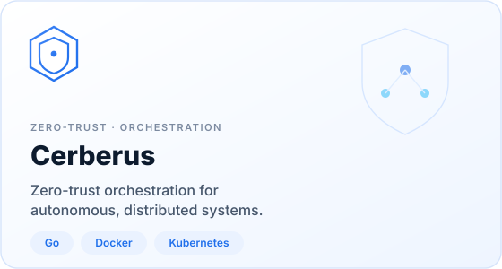</td>
</tr>
<tr>
<td width="50%">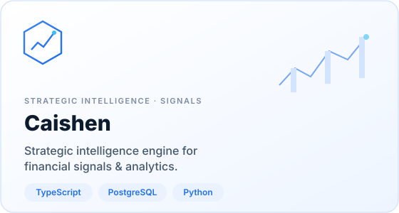</td>
<td width="50%">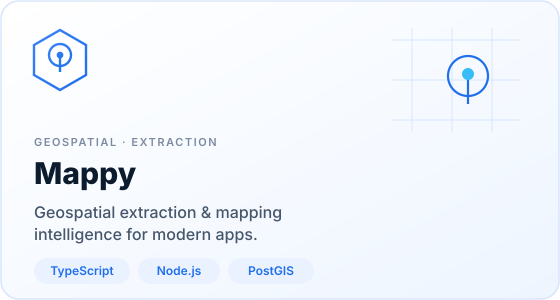</td>
</tr>
</table>

<!-- ░░░░░░░░░░░░░░░░░░░░  NODE SYSTEM MAP  ░░░░░░░░░░░░░░░░░░░░ -->
## The Node System

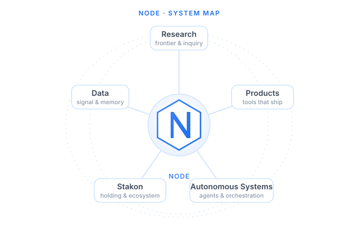

<!-- ░░░░░░░░░░░░░░░░░░░░  SKILLS + WORKFLOW  ░░░░░░░░░░░░░░░░░░░░ -->
<table border="0">
<tr>
<td width="46%" valign="middle" align="center">
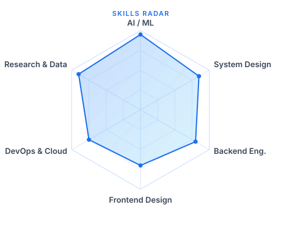
</td>
<td width="54%" valign="middle">

### How I work

A consistent loop, from research to running system:

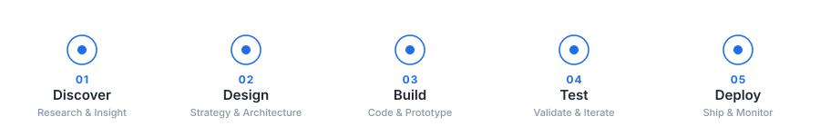

</td>
</tr>
</table>

<!-- ░░░░░░░░░░░░░░░░░░░░  RESEARCH / CURRENT FOCUS  ░░░░░░░░░░░░░░░░░░░░ -->

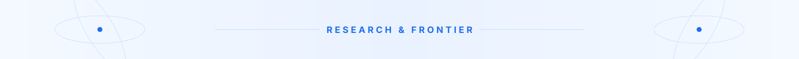

I work in the open on a small number of hard problems:

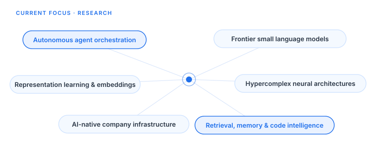

<!-- ░░░░░░░░░░░░░░░░░░░░  TECH  ░░░░░░░░░░░░░░░░░░░░ -->
## Tools of the trade

<!-- Hand-authored SVG, same visual system as the radar / node map.
     Source of truth: data/profile.json → stack. -->

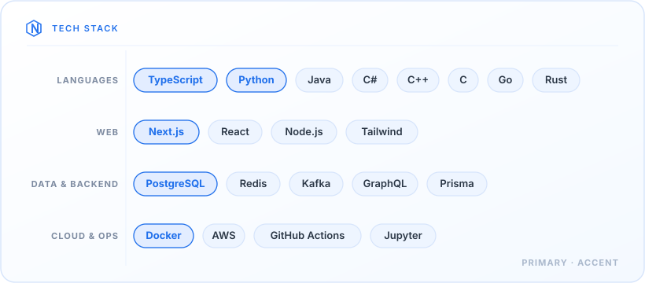

<!-- ░░░░░░░░░░░░░░░░░░░░  LIVE GITHUB DATA  ░░░░░░░░░░░░░░░░░░░░ -->
## Activity

<!-- All metrics below are pulled live from the GitHub API at render time —
     no figures are hand-written, so nothing here is ever fictional or stale. -->

&nbsp;

<!-- ░░░░░░░░░░░░░░░░░░░░  PHILOSOPHY  ░░░░░░░░░░░░░░░░░░░░ -->

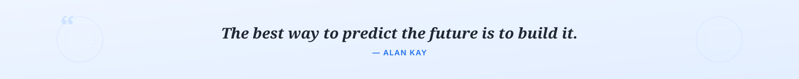

<!-- ░░░░░░░░░░░░░░░░░░░░  CONNECT  ░░░░░░░░░░░░░░░░░░░░ -->
## Connect

[**st0lym.stakon.fr**](https://st0lym.stakon.fr) &nbsp;·&nbsp; [**LinkedIn**](https://www.linkedin.com/in/jacques-marques-497a13168/) &nbsp;·&nbsp; [**X / Twitter**](https://x.com/St0lym_) &nbsp;·&nbsp; [**GitHub**](https://github.com/St0lym)

<!-- ░░░░░░░░░░░░░░░░░░░░  FOOTER  ░░░░░░░░░░░░░░░░░░░░ -->

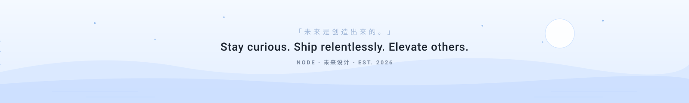

