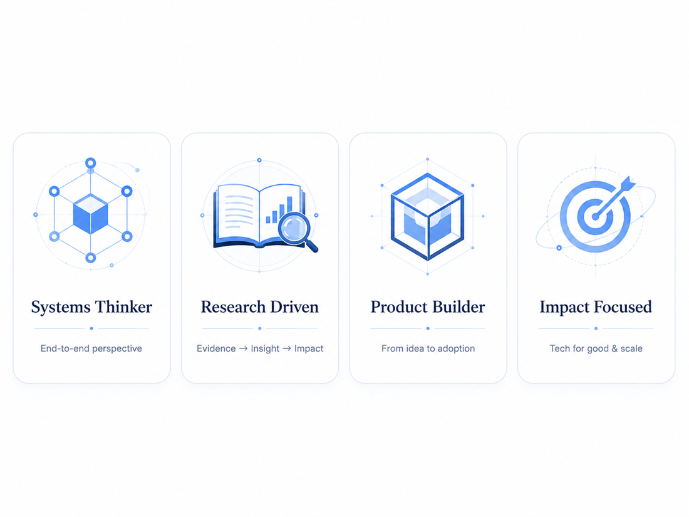
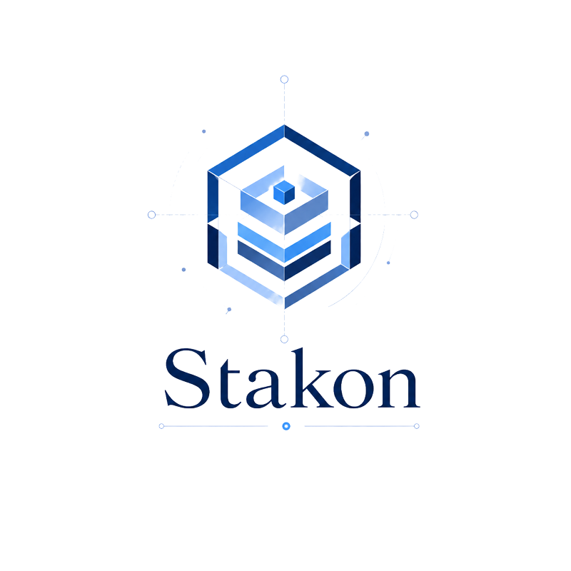
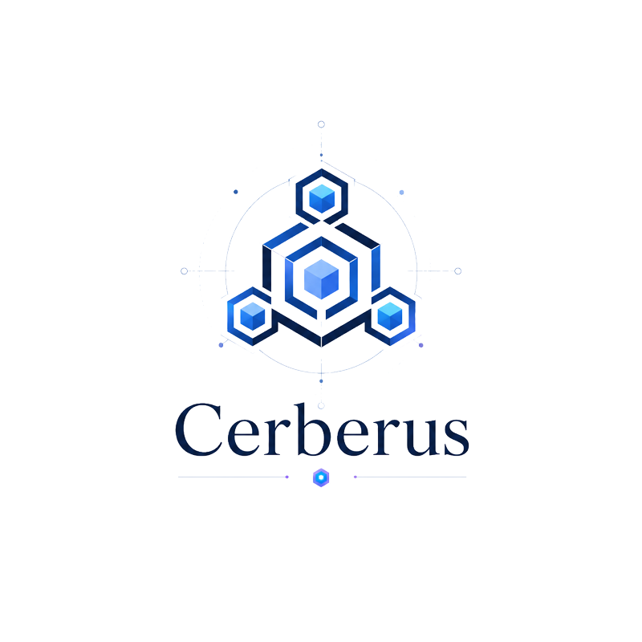
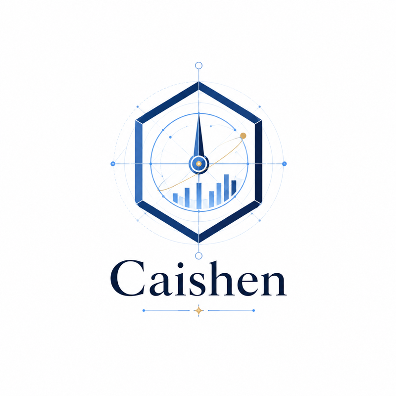
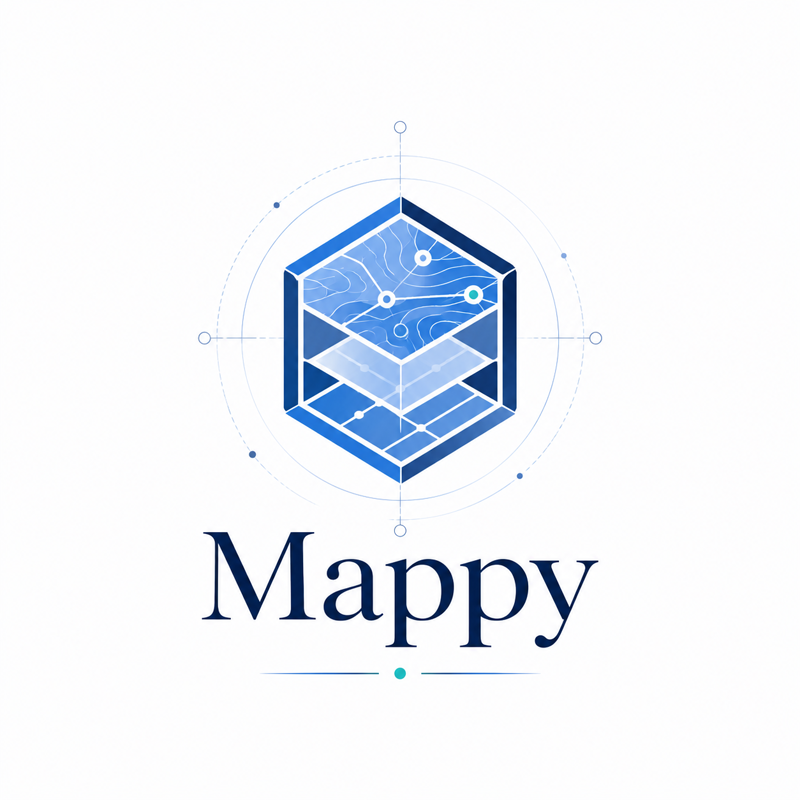
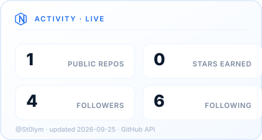
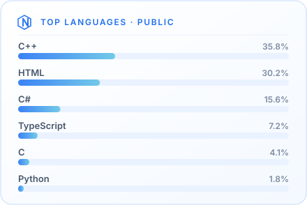

<!-- ╔══════════════════════════════════════════════════════════════════════╗
     ║  St0lym / St0lym  ·  GitHub profile                                   ║
     ║  Visual system lives in /assets — this file is composition + text.   ║
     ║  Raster art (hero, avatar, scenes) in /assets/illustrations (.webp).  ║
     ║  Diagrams (radar, node map, workflow, stack) in /assets/diagrams.     ║
     ╚══════════════════════════════════════════════════════════════════════╝ -->

<!-- ░░░░░░░░░░░░░░░░░░░░  HERO  ░░░░░░░░░░░░░░░░░░░░ -->

<a href="https://st0lym.stakon.fr">
  <picture>
    <source media="(prefers-color-scheme: dark)" srcset="./assets/illustrations/hero-dark.webp">
    <source media="(prefers-color-scheme: light)" srcset="./assets/illustrations/hero-light.webp">
    
  </picture>
</a>

<!-- Styled, animated nameplate (light/dark aware). Links stay in markdown below. -->

**Geneva, Switzerland** &nbsp;·&nbsp; [st0lym.stakon.fr](https://st0lym.stakon.fr) &nbsp;·&nbsp; open to consulting

<!-- ░░░░░░░░░░░░░░░░░░░░  IDENTITY / ABOUT  ░░░░░░░░░░░░░░░░░░░░ -->
## About

<table border="0">
<tr>
<td width="72%" valign="top">

I build **AI systems**, **autonomous infrastructure** and experimental tools
designed to transform complex ideas into operational products.

My work sits at the intersection of **artificial intelligence**, **distributed
systems**, **research**, **product architecture** and **automation** — from the
first question to the shipped system.

</td>
<td width="28%" valign="top" align="center">

</td>
</tr>
</table>

<!-- ░░░░░░░░░░░░░░░░░░░░  FEATURED SYSTEMS  ░░░░░░░░░░░░░░░░░░░░ -->
## Featured Systems

<table border="0">
<tr>
<td width="50%" align="center" valign="top">

**HOLDING · ECOSYSTEM** 
Holding and operating ecosystem for AI-native ventures. 
`TypeScript` `Next.js` `Monorepo`

</td>
<td width="50%" align="center" valign="top">

**ZERO-TRUST · ORCHESTRATION** 
Zero-trust orchestration for autonomous, distributed systems. 
`Go` `Docker` `Kubernetes`

</td>
</tr>
<tr>
<td width="50%" align="center" valign="top">

**STRATEGIC INTELLIGENCE · SIGNALS** 
Strategic intelligence engine for financial signals &amp; analytics. 
`TypeScript` `PostgreSQL` `Python`

</td>
<td width="50%" align="center" valign="top">

**GEOSPATIAL · EXTRACTION** 
Geospatial extraction &amp; mapping intelligence for modern apps. 
`TypeScript` `Node.js` `PostGIS`

</td>
</tr>
</table>

<!-- ░░░░░░░░░░░░░░░░░░░░  NODE SYSTEM MAP  ░░░░░░░░░░░░░░░░░░░░ -->
## The Node System

<!-- ░░░░░░░░░░░░░░░░░░░░  SKILLS + WORKFLOW  ░░░░░░░░░░░░░░░░░░░░ -->
<table border="0">
<tr>
<td width="46%" valign="middle" align="center">

</td>
<td width="54%" valign="middle">

### How I work

A consistent loop, from research to running system:

</td>
</tr>
</table>

<!-- ░░░░░░░░░░░░░░░░░░░░  RESEARCH / CURRENT FOCUS  ░░░░░░░░░░░░░░░░░░░░ -->

I work in the open on a small number of hard problems:

<!-- ░░░░░░░░░░░░░░░░░░░░  TECH  ░░░░░░░░░░░░░░░░░░░░ -->
## Tools of the trade

<!-- Hand-authored SVG, same visual system as the radar / node map.
     Source of truth: data/profile.json → stack. -->

<!-- ░░░░░░░░░░░░░░░░░░░░  LIVE GITHUB DATA  ░░░░░░░░░░░░░░░░░░░░ -->
## Activity

<!-- Self-hosted SVGs generated by scripts/generate-profile.mjs and refreshed
     daily by .github/workflows/update-profile.yml. Real GitHub API data,
     no third-party render service to break. -->
<table border="0">
<tr>
<td width="50%" align="center" valign="top">

</td>
<td width="50%" align="center" valign="top">

</td>
</tr>
</table>

<!-- ░░░░░░░░░░░░░░░░░░░░  PHILOSOPHY  ░░░░░░░░░░░░░░░░░░░░ -->

<!-- ░░░░░░░░░░░░░░░░░░░░  CONNECT  ░░░░░░░░░░░░░░░░░░░░ -->
## Connect

[**st0lym.stakon.fr**](https://st0lym.stakon.fr) &nbsp;·&nbsp; [**LinkedIn**](https://www.linkedin.com/in/jacques-marques-497a13168/) &nbsp;·&nbsp; [**X / Twitter**](https://x.com/St0lym_) &nbsp;·&nbsp; [**GitHub**](https://github.com/St0lym)

<!-- ░░░░░░░░░░░░░░░░░░░░  FOOTER  ░░░░░░░░░░░░░░░░░░░░ -->

